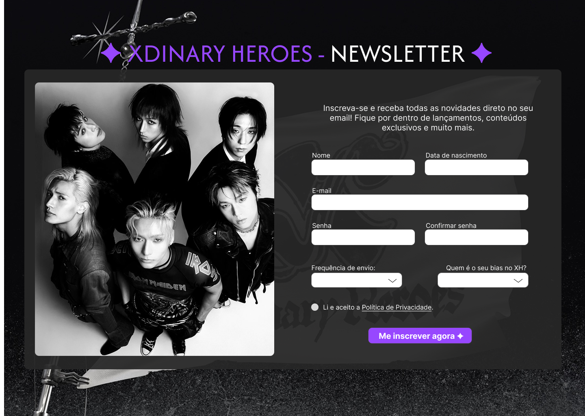

# ✦ Newsletter - Xdinary Heroes ✦

Projeto de uma página de inscrição para uma newsletter fictícia da banda **Xdinary Heroes**, com foco em design responsivo, validação de formulário e uma experiência de usuário agradável.

## ✦ Sobre o Projeto

Este é um formulário de inscrição completo, onde fãs da banda Xdinary Heroes podem se cadastrar para receber novidades, conteúdos exclusivos e mais. O projeto é totalmente desenvolvido com HTML, CSS e JavaScript.
- Desenvolvido para competência de Programar em linguagem interpretada

## ✦ Preview

 

## ✦ Funcionalidades

- Coleta de informações pessoais como nome, e-mail, telefone, CPF e data de nascimento.
- Campos de senha e confirmação de senha.
- Escolha da frequência de envio da newsletter.
- Escolha do bias favorito da banda.
- Checkbox de aceite da Política de Privacidade.
- Validação de todos os campos com mensagens de erro.
- Layout responsivo (usando `media-queries.css`).

## ✦ Acessibilidade

O projeto foi desenvolvido com boas práticas de acessibilidade web, garantindo que todos os usuários possam interagir com o formulário de forma eficiente:

- Utilização de aria-label para descrever campos e mensagens de erro, permitindo leitura clara por leitores de tela.
- Implementação de estados de foco personalizados (:focus) para destacar visualmente os campos ativos ao navegar com o teclado.
- Estrutura semântica com uso adequado de elementos HTML (<form>, <label>, etc.)
- Textos e contrastes ajustados para facilitar a leitura.
- Essas melhorias garantem uma experiência inclusiva, tanto para usuários que utilizam o mouse quanto para aqueles que dependem exclusivamente do teclado ou de tecnologias assistivas.

## ✦ Tecnologias Utilizadas

- **HTML5**
- **CSS3**
- **JavaScript**

### ✦ Veja aqui: [Newsletter - Xdinary Heroes](https://anadrv.github.io/newsletter-xdinary-heroes/) 

